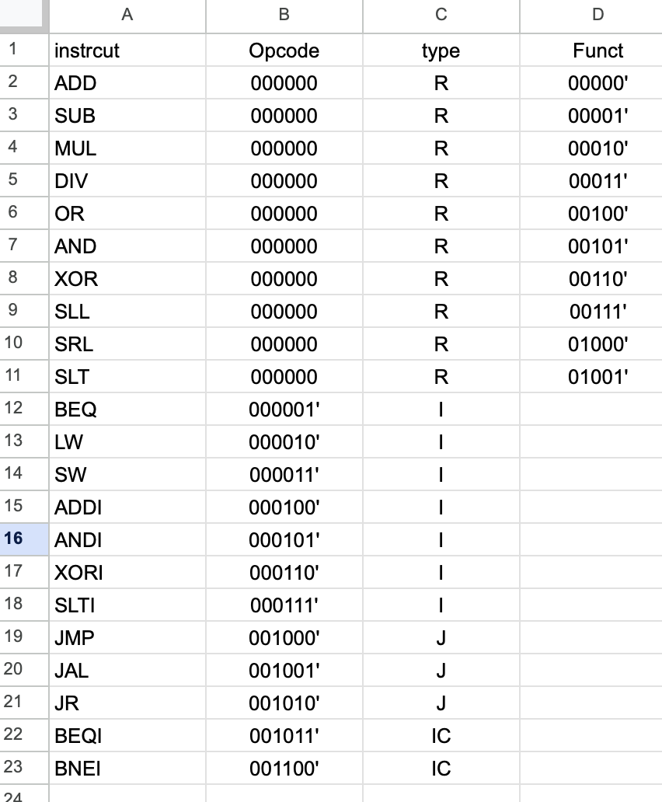

## Isaiah and Effie 

## BIT BUSTERS 
## 32-bit CPU in MIPS 

The Von Neumann architecture is a computer architecture that is based on the concept of a single memory unit for both data and instructions. The architecture was proposed by John von Neumann, and it has been widely used in modern computers. In this write-up, we will discuss a 32-bit MIPS implementation based on the Von Neumann architecture.

The purpose of this project is to design and implement a 32-bit MIPS CPU. The objective is to create a CPU that can execute a subset of the MIPS instruction set, while adhering to the basic principles of the Von Neumann architecture.

The overall design includes several main components, such as the ALU, control unit, registers, and memory. The ALU performs arithmetic and logical operations, the control unit manages the flow of data between the components, the registers store data and instructions, and the memory stores the program and data.

 The CPU is designed to fetch instructions and data from a single memory unit. The instruction set is based on a subset of the MIPS instruction set, which includes arithmetic, logical, load word /store word, branch,  and jump instructions.

The ISA 
    Our ISA is based off of MIPS 

ALU control 

Choices for our design 
 

Our ISA supports R, I, and J Type instructions. 
 

Our implemenatation uses this diagram 

Each module was and tested with its own testbench individually then integrated with each other to create the CPU with all the modules working together. 
The lists of modules include: 
 Adder, PC adder, ALU Decoder, Clock, Control Unit, CPU, data memory, Data Path, instruction decode, instruction Memory, The ALU, CPU      control, PC mux, program counter, Register file, and sign extender. 

### THE DESIGN DECISIONS 

A majority of the design descision made were based of the MIPS Data path. However, modifications to the datapath had to be made in order to incoperate jump and link (JAL) and JR (Jump register). Two new outputs were added to the control Unit in order to decide whether specific muxes would be on or off. For JAL a mux was made to decide between the result from data memory and or the next instruction that jal will link to the return address. Another mux was also added to write this address to the return address register. This mux chooses between the return adress register and the result from the value that would be normally written for other instructions. Lastly, a mux was added to determine if the next adresss in the program counter should be from the return adress register, an adder that increment the program counter or from a jump instruction. 

#### TESTING 

We generated 3 different codes to test our CPU on. We hand compiled based off our ISA and ran them all successfully. 
 
 TO TEST YOU MUST CHANGE THE TXT NAME IN instrmem.sv TO THE ONE YOU WANT. NEXT YOU NEED TO PUT THE FILE IN THE Datapath FOLDER. 

The first being leaf procedure: 
 
with output succesful on gtk wave  

The second being a nested procedure: 

here is the output: 

The third being fibbinocci: 

here is the output: 

for this run N was equal to 5 so output was 8 SUCCESS!

Improvements for future: 
Pipelining – take in multiple instructions instead of single cycle 
Assembler – generate the code for us instead of hand compiling 

